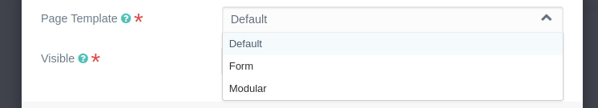

# Grav Admin Addon Page Blocks Plugin

This plugin make it possible to define a list of allowed page types, when add child pages. 

## Usage

Add an array of allowed page types in the page blueprint.

```yaml
...
templates:
 - default
 - modular
 - form
...
```



If you extend the defaults-page blueprint it effects all page types.

In this case you don't need this plugin. Use the build in admin feature 'hide_page_types' in file `user/config/plugins/admin.yaml`

```yaml
hide_page_types:
  - form
  - error
  - root
```


## Installation

### Grav Package Manager (GPM)

If you can access your Grav installation via the command line, install the plugin by typing the following from your Grav root:

```
bin/gpm install admin-addon-types
```

### Admin Tool Web Interface

In the **Plugins** section, hit the **[+ Add]** button, search for Admin Addon Page Blocks and install.

### Manual Installation

To install the plugin manually, download the ZIP version of this repository and unzip it under `/your/site/grav/user/plugins`. Then rename the folder to `admin-addon-types`.